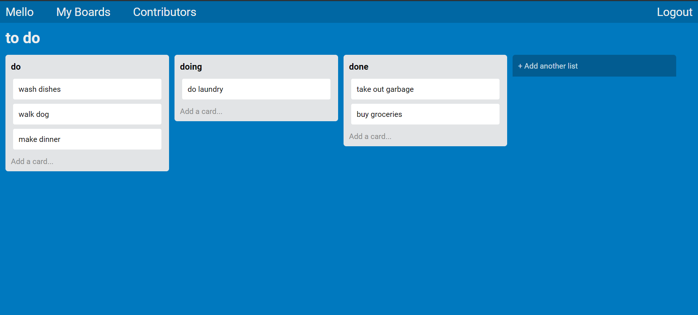

# mello-rails-api

## What is this:
Mello-rails-api is a Kanban board-style project management system, built with Ruby on Rails as well as HTML, CSS, JavaScript and JQuery. A fully functional database means your boards and changes persist between sessions. Features user validation and drag-and-drop functionality. To view the live version, visit https://frederic-hodges-mello.herokuapp.com/

